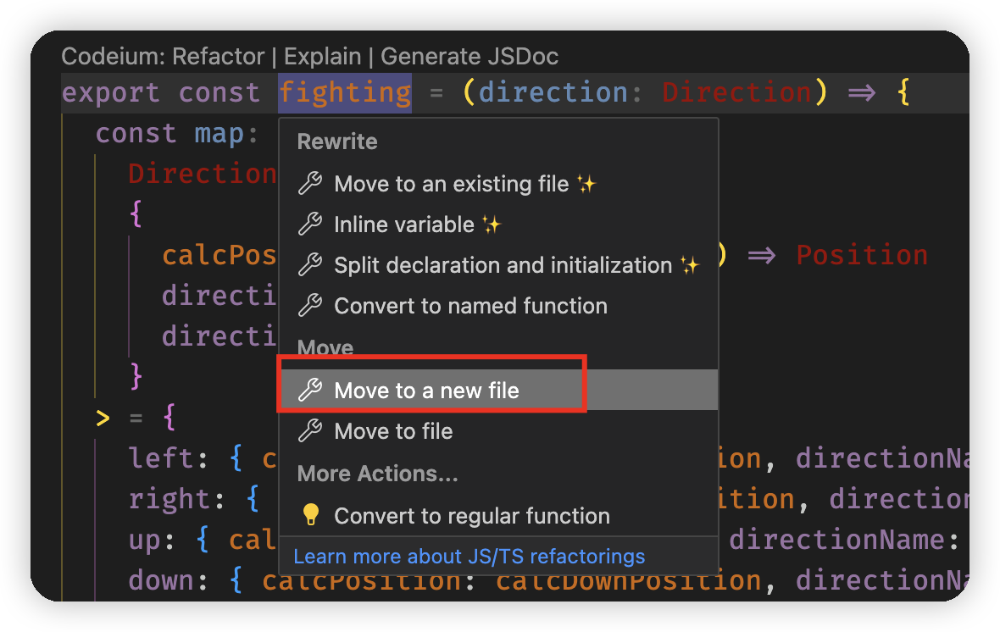

# sokoban-vue3

## [初始化项目](https://github.com/HenryTSZ/sokoban-vue3/tree/68b262e0a4772b868b4f4352bf41939f96a6b7ad)

## [创建地图](https://github.com/HenryTSZ/sokoban-vue3/tree/34ea99dbe041f1789aacd3aac3c7ad1f0b987fbd)

## [重构及单测地图](https://github.com/HenryTSZ/sokoban-vue3/tree/14888773c1b9d4c2c9a1f890cf836229dc0a66f7)

## [添加玩家](https://github.com/HenryTSZ/sokoban-vue3/tree/8b487da65560ececa311a5b7be7c3400e99608cf)

## [玩家移动位置](https://github.com/HenryTSZ/sokoban-vue3/tree/9acd676ee8399f2f41e666363a4ddf273c1930c4)

## [碰撞检测](https://github.com/HenryTSZ/sokoban-vue3/tree/76f2289456bfde01ede6f4b0948f8a3a5f78b5a6)

## [重构玩家数据结构](https://github.com/HenryTSZ/sokoban-vue3/tree/63fb1f9bd9915a4450b0b6c89deee6e11be7dd06)

## [完成玩家移动位置](https://github.com/HenryTSZ/sokoban-vue3/tree/3510c6b4f6509e21b5a36742b1527f74f1be9be9)

## [添加箱子](https://github.com/HenryTSZ/sokoban-vue3/tree/5275e5a04d37221b8e324e74aed5f539735c0f4b)

## [玩家推着箱子移动](https://github.com/HenryTSZ/sokoban-vue3/tree/0d342cc8055e080d1380ca282a8974c3b8157b2a)

## [箱子的碰撞检测](https://github.com/HenryTSZ/sokoban-vue3/tree/647a0520c5c760d5ae97a63292927d7fac684306)

## [完成箱子移动位置](https://github.com/HenryTSZ/sokoban-vue3/tree/d4357f05de68758614ea555ad7a6a496b37c2abd)

## [解决 Map.vue 遗留报错问题](https://github.com/HenryTSZ/sokoban-vue3/tree/4ac226cc42426d69b8b5ded3e3bb38ce9ad9f0aa)

## 重构移动逻辑

目前我们 4 个方向的移动逻辑大部分是相同的，只有这几个点是不同的：

1. 根据方向计算位置的函数
2. 需要改变的 key: "x" | "y"
3. key 的值: 1 | -1

### 抽离移动逻辑

这三个不同点其实都有一个依赖项：方向

那我们先定义方向的枚举:

```ts
enum Direction {
  Left = 'left',
  Right = 'right',
  Up = 'up',
  Down = 'down'
}
```

然后我们可以提取一个公共方法，参数就是方向，方法内部去处理不同点。

```ts
const fighting = (direction: Direction) => {
  // ...
}
```

方法内部将三个不同点定义出来，然后根据传入的方向去赋值:

```ts
const calcPosition, directionName, directionValue

switch (direction) {
  case Direction.Left:
    calcPosition = calcLeftPosition
    directionName = 'x'
    directionValue = -1
    break
  case Direction.Right:
    calcPosition = calcRightPosition
    directionName = 'x'
    directionValue = 1
    break
  case Direction.Up:
    calcPosition = calcUpPosition
    directionName = 'y'
    directionValue = -1
    break
  case Direction.Down:
    calcPosition = calcDownPosition
    directionName = 'y'
    directionValue = 1
}
```

也可以使用一个 map 对象:

```ts
const map: Record<
  Direction,
  {
    calcPosition: (position: Position) => Position
    directionName: 'x' | 'y'
    directionValue: 1 | -1
  }
> = {
  left: { calcPosition: calcLeftPosition, directionName: 'x', directionValue: -1 },
  right: { calcPosition: calcRightPosition, directionName: 'x', directionValue: 1 },
  up: { calcPosition: calcUpPosition, directionName: 'y', directionValue: -1 },
  down: { calcPosition: calcDownPosition, directionName: 'y', directionValue: 1 }
}
```

那我们就用 map 对象来处理方向了。

然后我们先重构 `moveLeft` 方法:

将 `moveLeft` 方法的逻辑全部拷贝到 `fighting` 方法中:

```ts
export const fighting = (direction: Direction) => {
  const map: Record<
    Direction,
    {
      calcPosition: (position: Position) => Position
      directionName: 'x' | 'y'
      directionValue: 1 | -1
    }
  > = {
    left: { calcPosition: calcLeftPosition, directionName: 'x', directionValue: -1 },
    right: { calcPosition: calcRightPosition, directionName: 'x', directionValue: 1 },
    up: { calcPosition: calcUpPosition, directionName: 'y', directionValue: -1 },
    down: { calcPosition: calcDownPosition, directionName: 'y', directionValue: 1 }
  }

  const position = calcLeftPosition(_keeper)
  if (wallCollision(position)) {
    return
  }
  // 1. 需要获取到 next left position 上的 cargo
  const cargo = getCargoByPosition(position)
  // 2. 改变这个 cargo 的位置
  if (cargo) {
    if (wallCollision(calcLeftPosition(cargo))) {
      return
    }
    cargo.x--
  }
  _keeper.x--
}
```

然后把那三个不同的地方修改一下：

```ts
export const fighting = (direction: Direction) => {
  const map: Record<
    Direction,
    {
      calcPosition: (position: Position) => Position
      directionName: 'x' | 'y'
      directionValue: 1 | -1
    }
  > = {
    left: { calcPosition: calcLeftPosition, directionName: 'x', directionValue: -1 },
    right: { calcPosition: calcRightPosition, directionName: 'x', directionValue: 1 },
    up: { calcPosition: calcUpPosition, directionName: 'y', directionValue: -1 },
    down: { calcPosition: calcDownPosition, directionName: 'y', directionValue: 1 }
  }

  const { calcPosition, directionName, directionValue } = map[direction]
  const keeper = getKeeper()

  const position = calcPosition(keeper)
  if (wallCollision(position)) {
    return
  }
  const cargo = getCargoByPosition(position)
  if (cargo) {
    if (wallCollision(calcPosition(cargo))) {
      return
    }
    cargo[directionName] += directionValue
  }
  keeper[directionName] += directionValue
}
```

再在 `moveLeft` 中调用 `fighting` 方法:

```ts
export const moveLeft = () => {
  fighting(Direction.Left)
}
```

测试没问题，页面也没问题。

那继续把 `moveRight` / `moveUp` / `moveDown` 方法修改一下，也都没有问题

目前 `fighting` 这个函数已经不止与 `keeper` 相关了，还与 `cargo` 相关，所以放在 `keeper.ts` 中就不合适了，我们可以使用 `VSCode` 自带的重构工具来将其提取为单独的文件。



这个重构工具可以自动检测所需要的依赖，并将这些依赖提取到单独的文件中，非常方便。

这样 `fighting.ts` 文件就是我们整个游戏的核心逻辑了。

再看一下测试，没有问题

### 抽离测试

目前我们把移动逻辑抽离出来了，那相应的测试也要抽离出来了。

创建一个 `src/game/test/fighting.spec.ts` 文件，内容就是把 `keeper.spec.ts` 文件中的内容复制过来，再重新整理一下

我们现在就分 4 组：`move left`、`move right`、`move up`、`move down`，里面就是 `keeper.spec.ts` 文件中对应的内容。

具体看 `src/game/test/fighting.spec.ts` 文件
