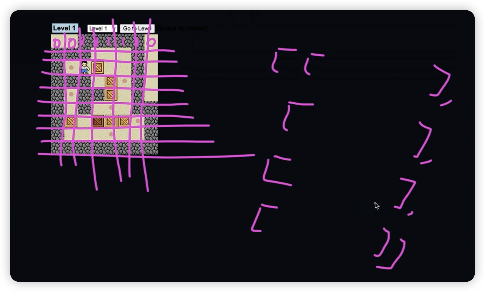
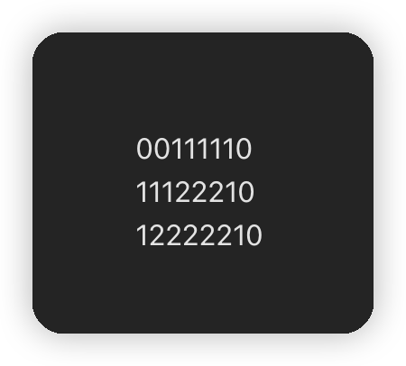
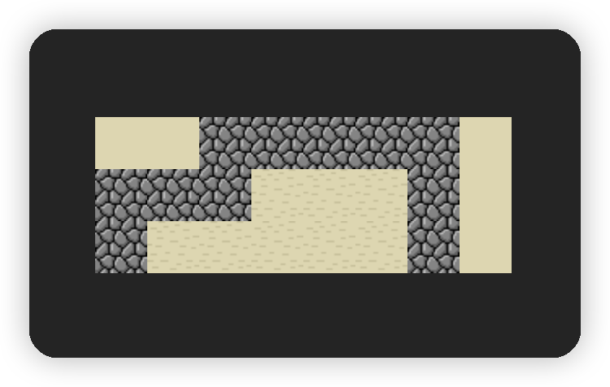

# sokoban-vue3

## [初始化项目](https://github.com/HenryTSZ/sokoban-vue3/tree/68b262e0a4772b868b4f4352bf41939f96a6b7ad)

## 创建地图

我们需要在 `components` 中创建一个 `Game.vue` 文件，用来管理游戏，还需要创建一个 `Map.vue` 文件，用来管理地图，分别在 `App.vue` 和 `Game.vue` 中引入。

观察地图，发现可以使用二维数组来表示地图



我们在 `Map.vue` 中创建地图的方法如下:

```vue
<template>
  <div class="map">
    <div class="row" v-for="row in map">
      <div class="col" v-for="col in row">
        {{ col }}
      </div>
    </div>
  </div>
</template>

<script setup lang="ts">
// 0. 空白
// 1. 墙
// 2. 地板
const map = [
  [0, 0, 1, 1, 1, 1, 1, 0],
  [1, 1, 1, 2, 2, 2, 1, 0],
  [1, 2, 2, 2, 2, 2, 1, 0]
]
</script>

<style scoped>
.row {
  display: flex;
}
.col {
}
</style>
```

效果如下：



然后我们就需要使用图片来替换一下，我们把图片放在 `assets` 文件夹下，然后在 `Map.vue` 中引入图片，然后根据地图的值来判断使用哪张图片。

```vue
<template>
  <div class="map">
    <div class="row" v-for="row in map">
      <div class="col" v-for="col in row">
        
        
        
      </div>
    </div>
  </div>
</template>

<script setup lang="ts">
import wall from '../assets/wall.png'
import floor from '../assets/floor.png'
import empty from '../assets/empty.png'

// 0. 空白
// 1. 墙
// 2. 地板
const map = [
  [0, 0, 1, 1, 1, 1, 1, 0],
  [1, 1, 1, 2, 2, 2, 1, 0],
  [1, 2, 2, 2, 2, 2, 1, 0]
]
</script>

<style scoped>
.row {
  display: flex;
}
.col .img {
  display: block;
}
</style>
```

效果如下：


