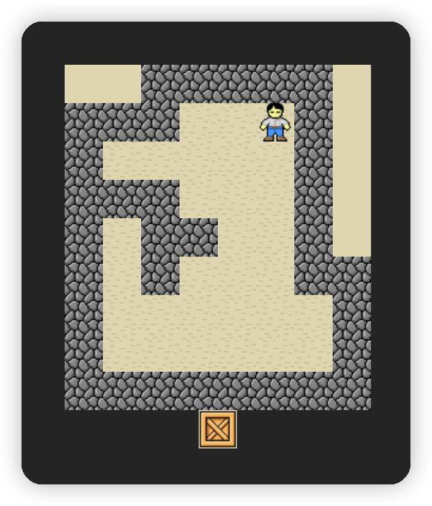
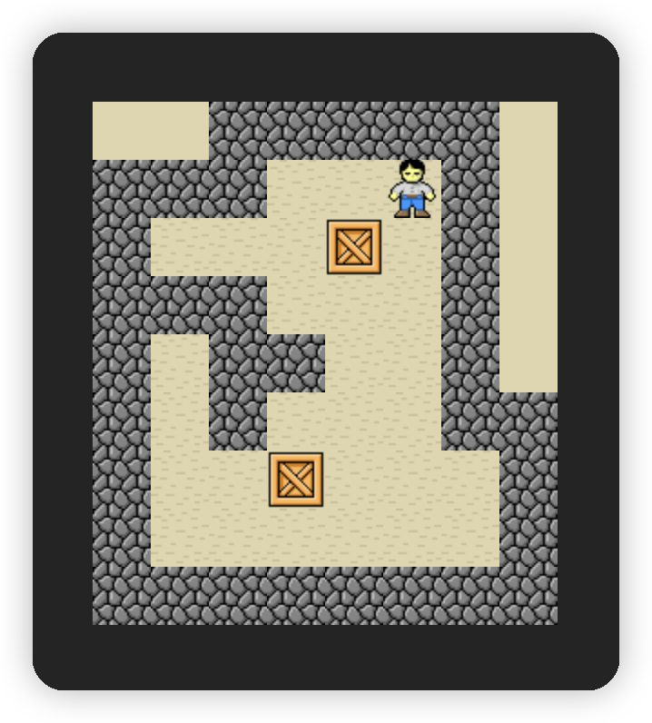

# sokoban-vue3

## [初始化项目](https://github.com/HenryTSZ/sokoban-vue3/tree/68b262e0a4772b868b4f4352bf41939f96a6b7ad)

## [创建地图](https://github.com/HenryTSZ/sokoban-vue3/tree/34ea99dbe041f1789aacd3aac3c7ad1f0b987fbd)

## [重构及单测地图](https://github.com/HenryTSZ/sokoban-vue3/tree/14888773c1b9d4c2c9a1f890cf836229dc0a66f7)

## [添加玩家](https://github.com/HenryTSZ/sokoban-vue3/tree/8b487da65560ececa311a5b7be7c3400e99608cf)

## [玩家移动位置](https://github.com/HenryTSZ/sokoban-vue3/tree/9acd676ee8399f2f41e666363a4ddf273c1930c4)

## [碰撞检测](https://github.com/HenryTSZ/sokoban-vue3/tree/76f2289456bfde01ede6f4b0948f8a3a5f78b5a6)

## [重构玩家数据结构](https://github.com/HenryTSZ/sokoban-vue3/tree/63fb1f9bd9915a4450b0b6c89deee6e11be7dd06)

## [完成玩家移动位置](https://github.com/HenryTSZ/sokoban-vue3/tree/3510c6b4f6509e21b5a36742b1527f74f1be9be9)

## 添加箱子

我们可以参考 `keeper` 的设计方案来设计箱子

初始化应该有多个箱子：`[{ x, y }, { x, y }, ...]`，和 `Keeper` 一样，渲染到页面上

然后就是箱子和玩家之间的碰撞检测了，当用户下一个位置是箱子的时候，要判断箱子是否可以向用户移动方向移动

最后，箱子是有两种状态的：普通状态和在放置点的状态

### 渲染箱子到页面

那我们先将箱子渲染到页面

先创建一个箱子的组件：`src/components/Cargo.vue`，与 `Empty.vue` 一样

```vue
<template>
  
</template>

<script setup lang="ts">
import cargo from '../assets/cargo.png'
</script>

<style scoped></style>
```

再将其添加到 `Game.vue` 中：

```vue
<template>
  <div class="container">
    <Map />
    <Keeper />
    <Cargo />
  </div>
</template>

<script setup lang="ts">
import Map from './Map.vue'
import Keeper from './Keeper.vue'
import Cargo from './Cargo.vue'
</script>
```

这样就可以在页面显示了



然后我们去处理数据

### 处理箱子数据

创建一个 `src/game/cargo.ts` 文件，逻辑与 `keeper.ts` 一样

```ts
import { Position } from '../composables/position'

export interface Cargo extends Position {}

let _cargos: Cargo[] = []

export const getCargos = (): Cargo[] => _cargos

export const initCargos = (cargos: Cargo[]): void => {
  _cargos = cargos
}
```

再在 `Cargo.vue` 中引入

```vue
<template>
  
</template>

<script setup lang="ts">
import { reactive } from 'vue'
import cargo from '../assets/cargo.png'
import { Cargo, initCargos } from '../game/cargo'
import { usePosition } from '../composables/position'

const cargos: Cargo[] = reactive([
  { x: 4, y: 2 },
  { x: 3, y: 6 }
])
initCargos(cargos)

const positionStyles = cargos.map(cargo => usePosition(cargo))
</script>

<style scoped>
.cargo {
  position: absolute;
}
</style>
```

处理箱子的位置正好可以复用当初 `keeper` 封装的 `usePosition` 方法，不过这里是多个位置

这样就可以在页面显示了



目前我们都是调整 UI 显示，故不需要写单测
