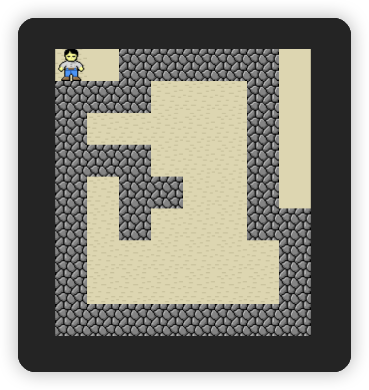

# sokoban-vue3

## [初始化项目](https://github.com/HenryTSZ/sokoban-vue3/tree/68b262e0a4772b868b4f4352bf41939f96a6b7ad)

## [创建地图](https://github.com/HenryTSZ/sokoban-vue3/tree/34ea99dbe041f1789aacd3aac3c7ad1f0b987fbd)

## [重构及单测地图](https://github.com/HenryTSZ/sokoban-vue3/tree/14888773c1b9d4c2c9a1f890cf836229dc0a66f7)

## 添加玩家

首先我们先要创建玩家的组件，与上节的 `Entity` 类似:

```vue
<template>
  
</template>

<script setup lang="ts">
import keeper from '../assets/keeper.png'
</script>

<style scoped>
.keeper {
  position: absolute;
  top: 0;
  left: 0;
}
</style>
```

然后在 `Game.vue` 中添加:

```vue
<template>
  <div class="container">
    <Map />
    <Keeper />
  </div>
</template>

<script setup lang="ts">
import Map from './Map.vue'
import Keeper from './Keeper.vue'
</script>

<style scoped>
.container {
  position: relative;
}
</style>
```

最外层的 `container` 用来包裹整个地图，使用相对定位，玩家使用绝对定位，当玩家移动时，只需要修改 `top` 和 `left` 的值即可。



这里有一个显示的小 bug：玩家的背景不是透明的，而是沙地，当我们放在空白上面时，就有点问题，不过玩家正确的位置应该就在沙地上，所以可以忽略这个问题。
