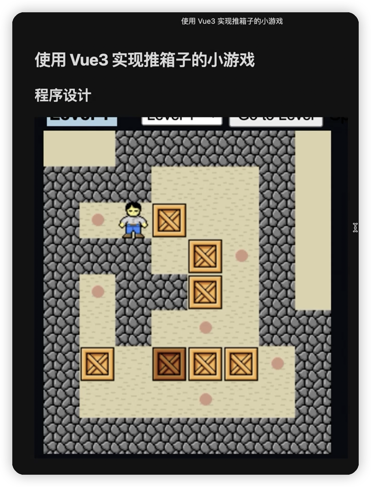
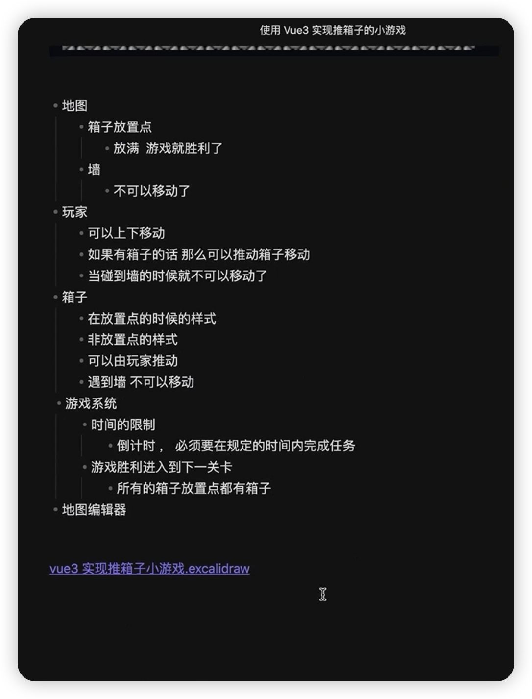
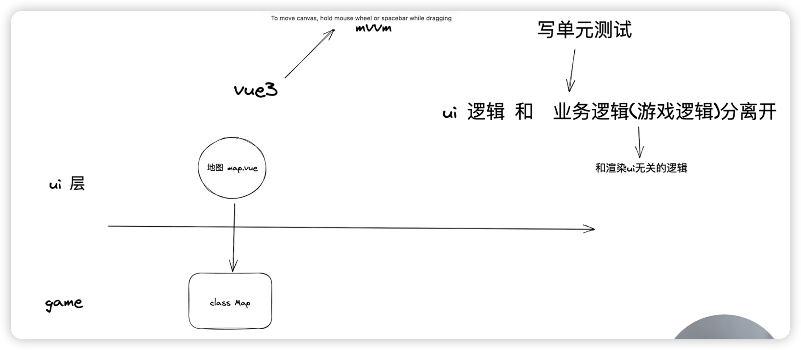
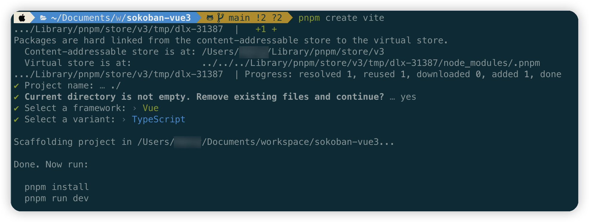

# sokoban-vue3

sokoban game by vue3







## 初始化项目

```bash
pnpm create vite
```



## 解决报错

如果报如下错误：

> Cannot find module 'vue'. Did you mean to set the 'moduleResolution' option to 'node', or to add aliases to the 'paths' option?Vetur(2792)

修改 `tsconfig.json`

```json
{
  // "moduleResolution": "bundler",
  "moduleResolution": "node"
}
```

如果报如下错误：

> Module ‘“xx.vue“‘ has no default export.Vetur(1192)

卸载 vetur，安装 volar 插件

[Module ‘“xx.vue“‘ has no default export.Vetur(1192)](https://blog.csdn.net/fengjingyu168/article/details/121564493)
