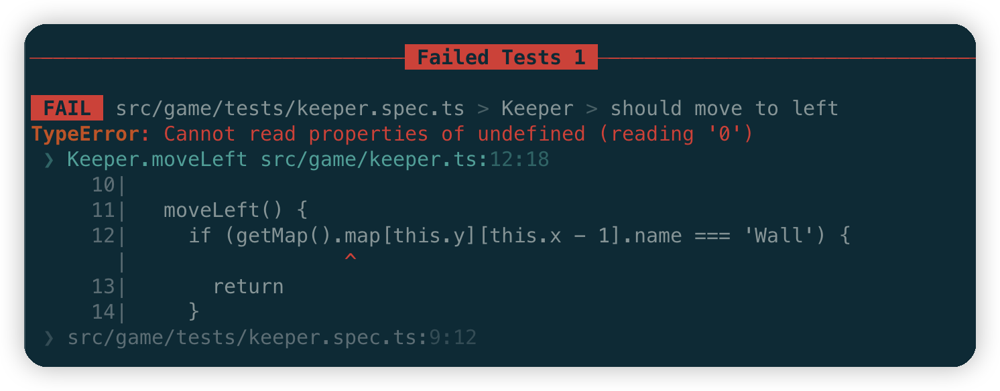
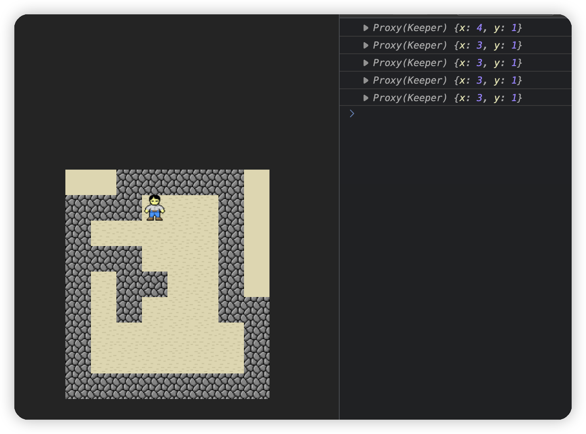

# sokoban-vue3

## [初始化项目](https://github.com/HenryTSZ/sokoban-vue3/tree/68b262e0a4772b868b4f4352bf41939f96a6b7ad)

## [创建地图](https://github.com/HenryTSZ/sokoban-vue3/tree/34ea99dbe041f1789aacd3aac3c7ad1f0b987fbd)

## [重构及单测地图](https://github.com/HenryTSZ/sokoban-vue3/tree/14888773c1b9d4c2c9a1f890cf836229dc0a66f7)

## [添加玩家](https://github.com/HenryTSZ/sokoban-vue3/tree/8b487da65560ececa311a5b7be7c3400e99608cf)

## [玩家移动位置](https://github.com/HenryTSZ/sokoban-vue3/tree/9acd676ee8399f2f41e666363a4ddf273c1930c4)

## 碰撞检测

当玩家移动的下一个位置是墙的时候，玩家就不能再移动了。

所以我们在 `moveLeft` 中需要检测玩家是否碰到墙。

检测的方法是：玩家的 `x` 和 `y` 在地图的二维数组中的位置是否是墙。

现在 `x` 和 `y` 我们在 `keeper.ts` 中能拿到，但地图的二维数组还拿不到。

我们只是在 `map.ts` 中将传入的二维数组处理了一下，并没有保存，所以我们需要在 `map.ts` 中保存。

### 保存地图

我们可以在 `initMap` 中保存地图的二维数组，然后暴漏出一个 `getMap` 方法来拿到地图。

```ts
export class Empty {
  public name = 'Empty'
}

export class Wall {
  public name = 'Wall'
}

export class Floor {
  public name = 'Floor'
}

export type Element = Empty | Wall | Floor

let _rowMap: number[][]
let _map: Element[][]

export const initMap = (rowMap: number[][]) => {
  _rowMap = rowMap
  const map = []
  for (let i = 0; i < rowMap.length; i++) {
    const row = []
    for (let j = 0; j < rowMap[i].length; j++) {
      switch (rowMap[i][j]) {
        case 0:
          row.push(new Empty())
          break
        case 1:
          row.push(new Wall())
          break
        case 2:
          row.push(new Floor())
          break
      }
    }
    map.push(row)
  }
  _map = map
  return map
}

export const getMap = () => ({ map: _map, rowMap: _rowMap })
```

### 检测玩家是否碰到墙

然后我们在 `moveLeft` 中判断一下下一个位置是否是墙：

```ts
moveLeft() {
  if (getMap().map[this.y][this.x - 1].name === 'Wall') {
    return
  }

  this.x--
}
```

### 添加单测

启动测试后发现报错了：



这是因为我们没有初始化地图。

所以我们需要修改一下这个单侧：

```ts
it('should move to left when next is not wall', () => {
  // 初始化地图
  initMap([
    [1, 1, 1, 1],
    [1, 2, 2, 1],
    [1, 2, 2, 1],
    [1, 1, 1, 1]
  ])
  // 初始化玩家位置
  const keeper = new Keeper(2, 1)
  // 向左移动
  keeper.moveLeft()
  // 测试玩家位置是否正确
  expect(keeper.x).toBe(1)
})
```

这样就测试通过了。

再加一个遇墙的单测:

```ts
it('should not move to left when next is wall', () => {
  // 初始化地图
  initMap([
    [1, 1, 1, 1],
    [1, 2, 2, 1],
    [1, 2, 2, 1],
    [1, 1, 1, 1]
  ])
  // 初始化玩家位置
  const keeper = new Keeper(1, 1)
  // 向左移动
  keeper.moveLeft()
  // 测试玩家位置是否正确
  expect(keeper.x).toBe(1)
})
```

测试通过

由于每次都需要初始化地图，而且都一致，所以我们可以把这部分逻辑提取出来：

```ts
describe('Keeper', () => {
  beforeEach(() => {
    // 初始化地图
    initMap([
      [1, 1, 1, 1],
      [1, 2, 2, 1],
      [1, 2, 2, 1],
      [1, 1, 1, 1]
    ])
  })
  it('should move to left when next is not wall', () => {
    // 初始化玩家位置
    const keeper = new Keeper(2, 1)
    // 向左移动
    keeper.moveLeft()
    // 测试玩家位置是否正确
    expect(keeper.x).toBe(1)
  })
  it('should not move to left when next is wall', () => {
    // 初始化玩家位置
    const keeper = new Keeper(1, 1)
    // 向左移动
    keeper.moveLeft()
    // 测试玩家位置是否正确
    expect(keeper.x).toBe(1)
  })
})
```

测试也没有问题

### 在页面测试一下

```ts
let keeper = new Keeper(5, 1)
```

也没有问题：


