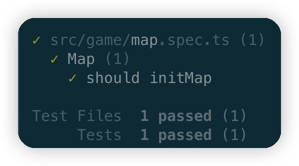

# sokoban-vue3

## [初始化项目](https://github.com/HenryTSZ/sokoban-vue3/tree/68b262e0a4772b868b4f4352bf41939f96a6b7ad)

## [创建地图](https://github.com/HenryTSZ/sokoban-vue3/tree/34ea99dbe041f1789aacd3aac3c7ad1f0b987fbd)

## 重构及单测地图

目前 `map` 的数据都是数字，这个也是我们后面实现的地图编辑器输出的格式

但是在游戏中，我们需要的是 `map` 的数据是 `object`，这样才能更好的处理

所以我们需要对 `map` 的数据进行重构

### 重构（包含手动测试）

先创建一个 `src/game/map.ts` 文件

```ts
class Empty {
  public name = 'Empty'
}

class Wall {
  public name = 'Wall'
}

class Floor {
  public name = 'Floor'
}

export const initMap = (rowMap: number[][]) => {
  const map = []
  for (let i = 0; i < rowMap.length; i++) {
    const row = []
    for (let j = 0; j < rowMap[i].length; j++) {
      switch (rowMap[i][j]) {
        case 0:
          row.push(new Empty())
          break
        case 1:
          row.push(new Wall())
          break
        case 2:
          row.push(new Floor())
          break
      }
    }
    map.push(row)
  }
  return map
}
```

在 `Map.vue` 中，我们需要对 `map` 进行处理

```vue
<template>
  <div class="map">
    <div class="row" v-for="row in map">
      <div class="col" v-for="col in row">
        
        
        
      </div>
    </div>
  </div>
</template>

<script setup lang="ts">
import wall from '../assets/wall.png'
import floor from '../assets/floor.png'
import empty from '../assets/empty.png'
import { initMap } from '../game/map'

// 0. 空白
// 1. 墙
// 2. 地板
const rowMap = [
  [0, 0, 1, 1, 1, 1, 1, 0],
  [1, 1, 1, 2, 2, 2, 1, 0],
  [1, 2, 2, 2, 2, 2, 1, 0]
]

const map = initMap(rowMap)
</script>

<style scoped>
.row {
  display: flex;
}
.col .img {
  display: block;
}
</style>
```

显示效果与重构前一致

### 单元测试

首先安装 [vitest](https://vitest.dev/)

```sh
pnpm i -D vitest
```

创建 `src/game/tests/map.spec.ts` 文件

```ts
import { describe, expect, it } from 'vitest'
import { Empty, Floor, Wall, initMap } from '../map'

describe('Map', () => {
  it('should initMap', () => {
    const rowMap = [[0, 1, 2]]
    const map = initMap(rowMap)
    expect(map).toEqual([[new Empty(), new Wall(), new Floor()]])
  })
})
```

在 `package.json` 中添加 `test` 命令

```json
{
  "scripts": {
    "test": "vitest"
  }
}
```

运行测试：

```sh
pnpm test
```

可以看到测试通过了：



对比手动测试可以发现：

手动测试我们必须要修改 `Map.vue` 文件，把结果放到视图中对比，查看结果是否一致，这个过程很麻烦，所以我们需要单元测试来帮助我们

而单元测试不需要修改 `Map.vue` 文件，只需要查看是否把 0, 1, 2 转换成 `Empty`, `Wall`, `Floor` 即可，运行测试就可以了，这个过程很简单

### UI 重构

在 `Map.vue` 中，我们需要对下面的代码进行重构，太多 `if else` 了，不够优雅

```vue


```

我们可以将其都抽离为一个组件，以 `Empty` 为例

```vue
<template>
  
</template>

<script setup lang="ts">
import empty from '../assets/empty.png'
</script>

<style scoped></style>
```

然后在 `Map.vue` 中进行更新：

```vue
<template>
  <div class="map">
    <div class="row" v-for="row in map">
      <div class="col" v-for="col in row">
        <component :is="componentMap[col.name]" />
      </div>
    </div>
  </div>
</template>

<script setup lang="ts">
import Empty from './Empty.vue'
import Wall from './Wall.vue'
import Floor from './Floor.vue'
import { initMap } from '../game/map'

// 0. 空白
// 1. 墙
// 2. 地板
const rowMap = [
  [0, 0, 1, 1, 1, 1, 1, 0],
  [1, 1, 1, 2, 2, 2, 1, 0],
  [1, 2, 2, 2, 2, 2, 1, 0]
]

const map = initMap(rowMap)

const componentMap = {
  Empty,
  Wall,
  Floor
}
</script>

<style scoped>
.row {
  display: flex;
}
.map-img {
  display: block;
}
</style>
```

目前 `<component :is="componentMap[col.name]" />` 有类型错误，先暂时不处理
