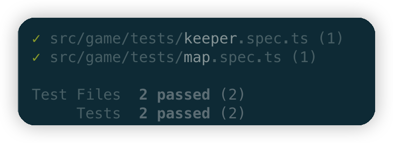
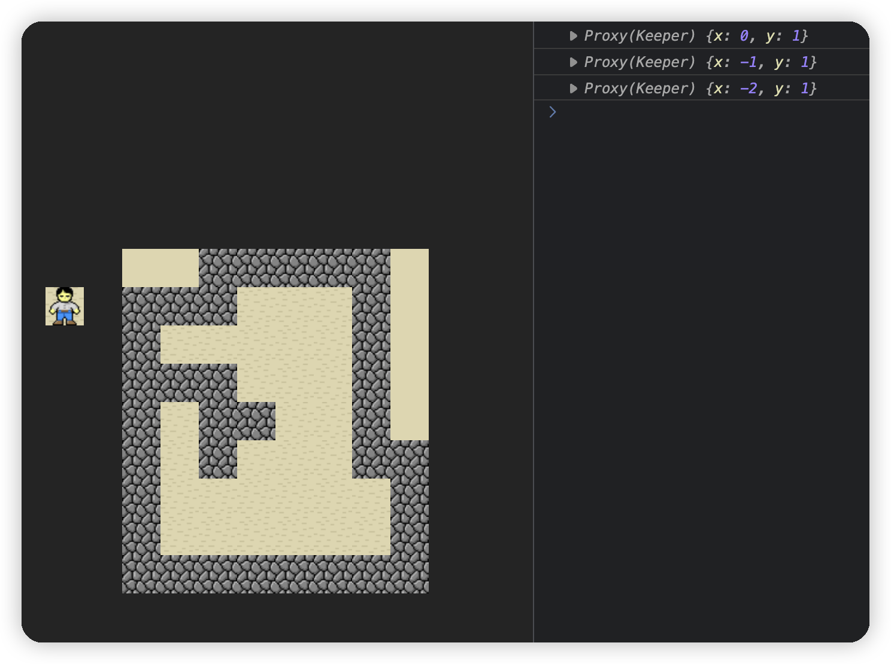

# sokoban-vue3

## [初始化项目](https://github.com/HenryTSZ/sokoban-vue3/tree/68b262e0a4772b868b4f4352bf41939f96a6b7ad)

## [创建地图](https://github.com/HenryTSZ/sokoban-vue3/tree/34ea99dbe041f1789aacd3aac3c7ad1f0b987fbd)

## [重构及单测地图](https://github.com/HenryTSZ/sokoban-vue3/tree/14888773c1b9d4c2c9a1f890cf836229dc0a66f7)

## [添加玩家](https://github.com/HenryTSZ/sokoban-vue3/tree/8b487da65560ececa311a5b7be7c3400e99608cf)

## 玩家移动位置

### 设计玩家数据结构

由于玩家是绝对定位，通过 `top` 和 `left` 属性来设置位置，故应该有 `x` 和 `y` 两个属性来表示位置，具体取值与 `rowMap` 相关。

比如 `{ x: 0, y: 0 }` 表示玩家在第一行第一列的位置，对应的 `top` 和 `left` 属性应该为 `0`，`{ x: 1, y: 1 }` 表示玩家在第二行第二列的位置，对应的 `top` 和 `left` 属性应该为 `32px`(图片大小为 `32px`)。

### 使用 TDD 来测试玩家位置

先创建一个 `src/game/tests/keeper.spec.ts` 文件

```typescript
import { describe, expect, it } from 'vitest'

describe('Keeper', () => {
  it('should move to left', () => {
    // 初始化玩家位置
    // 向左移动
    // 测试玩家位置是否正确
  })
})
```

#### 初始化玩家位置

先创建一个 `src/game/keeper.ts` 文件，使用 `Class` 来定义玩家类。

```typescript
export class Keeper {
  x: number
  y: number
  constructor(x: number, y: number) {
    this.x = x
    this.y = y
  }
}
```

这样使用 `const keeper = new Keeper(0, 0)` 即可初始化玩家位置。

#### 向左移动

我们还需要添加一个 `moveLeft` 方法：

```typescript
export class Keeper {
  x: number
  y: number
  constructor(x: number, y: number) {
    this.x = x
    this.y = y
  }

  moveLeft() {
    this.x--
  }
}
```

### 测试玩家位置是否正确

```typescript
import { describe, expect, it } from 'vitest'
import { Keeper } from '../keeper'

describe('Keeper', () => {
  it('should move to left', () => {
    // 初始化玩家位置
    const keeper = new Keeper(1, 0)
    // 向左移动
    keeper.moveLeft()
    // 测试玩家位置是否正确
    expect(keeper.x).toBe(0)
  })
})
```



可以看到测试通过了。

### 添加到页面中

由于控制玩家移动需要使用键盘事件，所以需要在 `src/components/Keeper.vue` 中添加键盘事件监听。

```vue
<template>
  
</template>

<script setup lang="ts">
import { onMounted, onUnmounted } from 'vue'
import keeperSrc from '../assets/keeper.png'
import { Keeper } from '../game/keeper'

const keeper = new Keeper(1, 1)

function handleKeyup(e: KeyboardEvent) {
  switch (e.code) {
    case 'ArrowLeft':
    case 'KeyH':
      keeper.moveLeft()
      console.log(keeper)
      break
    default:
      break
  }
}
onMounted(() => {
  window.addEventListener('keyup', handleKeyup)
})
onUnmounted(() => {
  window.removeEventListener('keyup', handleKeyup)
})
</script>

<style scoped>
.keeper {
  position: absolute;
}
</style>
```

测试发现 `keeper` 的 `x` 和 `y` 属性都是正确的，但玩家位置不是正确的，这是由于响应丢失的原因。

那我们只需要使用 `reactive` 来修复这个问题。

```ts
let keeper = new Keeper(1, 1)
keeper = reactive(keeper)
```

可以看到玩家的位置已经修复。



但由于没有做碰撞检测，玩家会一直移动，即使碰到墙。
