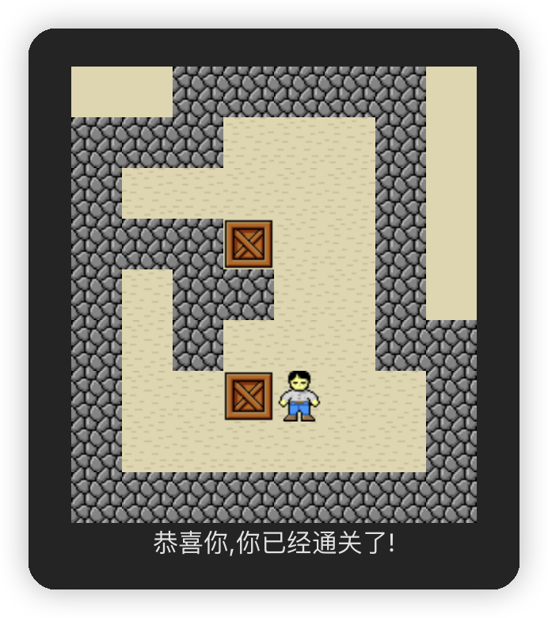

# sokoban-vue3

## [初始化项目](https://github.com/HenryTSZ/sokoban-vue3/tree/68b262e0a4772b868b4f4352bf41939f96a6b7ad)

## [创建地图](https://github.com/HenryTSZ/sokoban-vue3/tree/34ea99dbe041f1789aacd3aac3c7ad1f0b987fbd)

## [重构及单测地图](https://github.com/HenryTSZ/sokoban-vue3/tree/14888773c1b9d4c2c9a1f890cf836229dc0a66f7)

## [添加玩家](https://github.com/HenryTSZ/sokoban-vue3/tree/8b487da65560ececa311a5b7be7c3400e99608cf)

## [玩家移动位置](https://github.com/HenryTSZ/sokoban-vue3/tree/9acd676ee8399f2f41e666363a4ddf273c1930c4)

## [碰撞检测](https://github.com/HenryTSZ/sokoban-vue3/tree/76f2289456bfde01ede6f4b0948f8a3a5f78b5a6)

## [重构玩家数据结构](https://github.com/HenryTSZ/sokoban-vue3/tree/63fb1f9bd9915a4450b0b6c89deee6e11be7dd06)

## [完成玩家移动位置](https://github.com/HenryTSZ/sokoban-vue3/tree/3510c6b4f6509e21b5a36742b1527f74f1be9be9)

## [添加箱子](https://github.com/HenryTSZ/sokoban-vue3/tree/5275e5a04d37221b8e324e74aed5f539735c0f4b)

## [玩家推着箱子移动](https://github.com/HenryTSZ/sokoban-vue3/tree/0d342cc8055e080d1380ca282a8974c3b8157b2a)

## [箱子的碰撞检测](https://github.com/HenryTSZ/sokoban-vue3/tree/647a0520c5c760d5ae97a63292927d7fac684306)

## [完成箱子移动位置](https://github.com/HenryTSZ/sokoban-vue3/tree/d4357f05de68758614ea555ad7a6a496b37c2abd)

## [解决 Map.vue 遗留报错问题](https://github.com/HenryTSZ/sokoban-vue3/tree/4ac226cc42426d69b8b5ded3e3bb38ce9ad9f0aa)

## [重构移动逻辑](https://github.com/HenryTSZ/sokoban-vue3/tree/99b7c77ab47744ee8d1a4d6d5cbc230205fa0804)

## [箱子与箱子的碰撞检测](https://github.com/HenryTSZ/sokoban-vue3/tree/7531444c086a345cce0855ef7956598b19fd8ef7)

## [添加放置点](https://github.com/HenryTSZ/sokoban-vue3/tree/252048acc321dd3c0fadf645ca558d0f612f26d7)

## [箱子与放置点的碰撞检测](https://github.com/HenryTSZ/sokoban-vue3/tree/70da190fc5ef796eab8ed2b2f9c103f1c7e321f5)

## 检测游戏是否胜利

当所有箱子都放置在放置点上时，游戏胜利，弹出进入下一关的按钮

这个触发逻辑就是玩家推完箱子以后，循环所有箱子，判断其 `onTargetPosition` 是否为 `true`，当所有为 `true` 时，游戏胜利

### TDD 游戏是否胜利

我们先来写测试

```ts
describe('game statue', () => {
  it('should game win when all cargo hit all target', () => {
    initMap([[1, 2, 2, 3, 1]])
    initKeeper({ x: 0, y: 1 })
    initCargos([{ x: 0, y: 2 }])
    fighting(Direction.Right)
    const game = getGame()
    expect(game.isWin).toBe(true)
  })
})
```

目前我们没有 `getGame` 方法，所以先实现它

### 创建 game

由上面的测试我们可知：`game` 有两个属性，一个是代表游戏是否胜利的 `win`，另一个是代表当前关卡的 `level`

创建 `src/game/game.ts` 文件，并添加如下代码

```ts
export interface Game {
  isWin: boolean
  level: number
}

let _game: Game

export const initGame = (game: Game) => {
  _game = game
}

export const getGame = () => {
  return _game
}
```

然后在测试方法中添加 `initGame`

```ts
initGame({
  isWin: false,
  level: 1
})
```

当然现在测试是不通过的，预期是 `true`，实际是 `false`

### 实现 isWin

我们上面已经分析了 `isWin` 的实现逻辑：玩家推完箱子以后，循环所有箱子，判断其 `onTargetPosition` 是否为 `true`，当所有为 `true` 时，游戏胜利

所以我们还需要去 `fighting` 方法中添加 `isWin` 逻辑

```ts
if (cargo) {
  if (wallCollision(calcPosition(cargo))) {
    return
  }
  if (cargoCollision(calcPosition(cargo))) {
    return
  }
  cargo[directionName] += directionValue

  cargo.onTargetPoint = targetCollision(cargo)

  const game = getGame()
  if (game) {
    game.isWin = getCargos().every(cargo => cargo.onTargetPoint)
  }
}
```

测试通过了

然后我们去页面处理一下

```vue
<template>
  <div class="container">
    <Map />
    <Keeper />
    <Cargo />
    <div v-if="game.isWin">恭喜你,你已经通关了!</div>
  </div>
</template>

<script setup lang="ts">
import Map from './Map.vue'
import Keeper from './Keeper.vue'
import Cargo from './Cargo.vue'
import { reactive } from 'vue'
import { initGame } from '../game/game'

const game = reactive({
  isWin: false,
  level: 1
})
initGame(game)
</script>

<style scoped>
.container {
  position: relative;
}
</style>
```

也没有问题



### 重构

目前我们更新游戏状态是在 `fighting` 方法中，属于低层次的代码，所以我们可以将更新游戏状态的逻辑提取出来

在 `game.ts` 文件中

```ts
export const judgeGameWin = () => {
  _game.isWin = getCargos().every(cargo => cargo.onTargetPoint)
}
```

但 `getCargos().every(cargo => cargo.onTargetPoint)` 又是和 `cargo` 相关的，所以我们可以把这个逻辑提取到 `cargo.ts` 中

在 `cargo.ts` 中

```ts
export const isAllCargoOnTarget = (): boolean => {
  return _cargos.every(cargo => cargo.onTargetPoint)
}
```

最终代码：

`fighting.ts`

```ts
if (cargo) {
  if (wallCollision(calcPosition(cargo))) {
    return
  }
  if (cargoCollision(calcPosition(cargo))) {
    return
  }
  cargo[directionName] += directionValue

  cargo.onTargetPoint = targetCollision(cargo)

  judgeGameWin()
}
```

`game.ts`

```ts
export const judgeGameWin = () => {
  _game.isWin = isAllCargoOnTarget()
}
```

这时候我们检测游戏是否胜利的测试是通过的，但以前移动箱子的测试报错了，是因为我们没有初始化 `game`，导致更新 `isWin` 的时候报错了：

> TypeError: Cannot set properties of undefined (setting 'isWin')

我们可以在 `beforeEach` 方法中初始化 `game`

```ts
beforeEach(() => {
  initMap([
    [1, 1, 1, 1, 1],
    [1, 2, 2, 2, 1],
    [1, 2, 2, 2, 1],
    [1, 2, 2, 2, 1],
    [1, 1, 1, 1, 1]
  ])
  initGame({
    isWin: false,
    level: 1
  })
})
```

这样就没问题了

同样的，`cargo.onTargetPoint = targetCollision(cargo)` 也可以重构一下，提取到 `cargo.ts` 中

```ts
export const handleHitTargetPoint = (cargo: Cargo): void => {
  cargo.onTargetPoint = targetCollision(cargo)
}
```

`fighting.ts` 调用一下

```ts
if (cargo) {
  if (wallCollision(calcPosition(cargo))) {
    return
  }
  if (cargoCollision(calcPosition(cargo))) {
    return
  }
  cargo[directionName] += directionValue

  handleHitTargetPoint(cargo)

  judgeGameWin()
}
```

测试通过，页面也没问题
