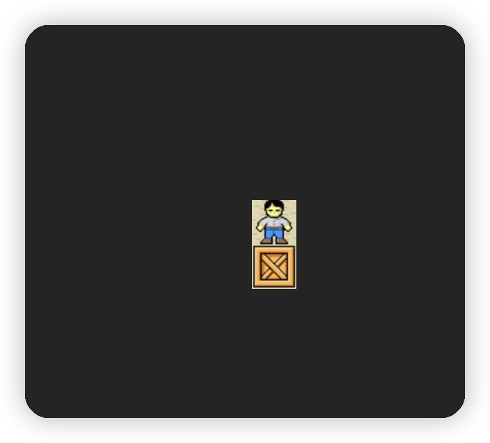
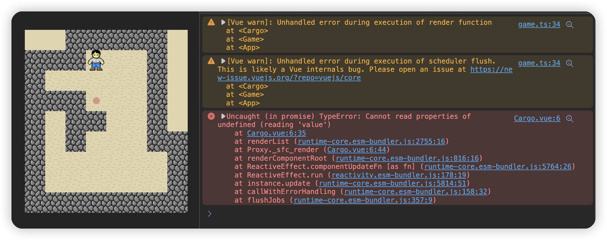

# sokoban-vue3

## [初始化项目](https://github.com/HenryTSZ/sokoban-vue3/tree/68b262e0a4772b868b4f4352bf41939f96a6b7ad)

## [创建地图](https://github.com/HenryTSZ/sokoban-vue3/tree/34ea99dbe041f1789aacd3aac3c7ad1f0b987fbd)

## [重构及单测地图](https://github.com/HenryTSZ/sokoban-vue3/tree/14888773c1b9d4c2c9a1f890cf836229dc0a66f7)

## [添加玩家](https://github.com/HenryTSZ/sokoban-vue3/tree/8b487da65560ececa311a5b7be7c3400e99608cf)

## [玩家移动位置](https://github.com/HenryTSZ/sokoban-vue3/tree/9acd676ee8399f2f41e666363a4ddf273c1930c4)

## [碰撞检测](https://github.com/HenryTSZ/sokoban-vue3/tree/76f2289456bfde01ede6f4b0948f8a3a5f78b5a6)

## [重构玩家数据结构](https://github.com/HenryTSZ/sokoban-vue3/tree/63fb1f9bd9915a4450b0b6c89deee6e11be7dd06)

## [完成玩家移动位置](https://github.com/HenryTSZ/sokoban-vue3/tree/3510c6b4f6509e21b5a36742b1527f74f1be9be9)

## [添加箱子](https://github.com/HenryTSZ/sokoban-vue3/tree/5275e5a04d37221b8e324e74aed5f539735c0f4b)

## [玩家推着箱子移动](https://github.com/HenryTSZ/sokoban-vue3/tree/0d342cc8055e080d1380ca282a8974c3b8157b2a)

## [箱子的碰撞检测](https://github.com/HenryTSZ/sokoban-vue3/tree/647a0520c5c760d5ae97a63292927d7fac684306)

## [完成箱子移动位置](https://github.com/HenryTSZ/sokoban-vue3/tree/d4357f05de68758614ea555ad7a6a496b37c2abd)

## [解决 Map.vue 遗留报错问题](https://github.com/HenryTSZ/sokoban-vue3/tree/4ac226cc42426d69b8b5ded3e3bb38ce9ad9f0aa)

## [重构移动逻辑](https://github.com/HenryTSZ/sokoban-vue3/tree/99b7c77ab47744ee8d1a4d6d5cbc230205fa0804)

## [箱子与箱子的碰撞检测](https://github.com/HenryTSZ/sokoban-vue3/tree/7531444c086a345cce0855ef7956598b19fd8ef7)

## [添加放置点](https://github.com/HenryTSZ/sokoban-vue3/tree/252048acc321dd3c0fadf645ca558d0f612f26d7)

## [箱子与放置点的碰撞检测](https://github.com/HenryTSZ/sokoban-vue3/tree/70da190fc5ef796eab8ed2b2f9c103f1c7e321f5)

## [检测游戏是否胜利](https://github.com/HenryTSZ/sokoban-vue3/tree/c99ae23cefbc9ebf360e413b09fb4741f368e2cf)

## [进入下一关](https://github.com/HenryTSZ/sokoban-vue3/tree/07c7d67d567e639c7ce7471e20274de27e894482)

## 重构所有数据处理

目前我们是在各个 UI 组件内监听 `level` 的变化，再重新获取对应的数据，然后重新渲染。

那其实我们可以在 `level` 改变的方法里统一处理所有数据的变化。

### 抽离改变 `level` 的方法

目前改变 `level` 的方法在 `Game.vue` 中，所以我们需要将其提取到 `game.ts` 中。

```ts
export const handleNextLevel = () => {
  const level = _game.level + 1
  _game.level = level
  _game.isWin = false
}
```

然后将 `handleNextLevel` 引入到 `Game.vue` 中即可

```ts
import { initGame, handleNextLevel } from '../game/game'
```

### 统一处理所有数据的变化

#### 抽离响应式数据思维

那在 `handleNextLevel` 方法里，我们需要统一处理所有数据的变化。

先处理 `map` 的逻辑，将 `watchEffect` 中的逻辑抽离到 `map.ts`

但这里出现问题了，`watchEffect` 里的 `map` 在 `Map.vue` 中是响应式对象，而我们这里没有响应式了。

除非我们在 `map.ts` 中声明 `_map` 的时候就使用 `reactive` 来声明，但这样就将 `UI` 与数据耦合了。

那我们可以这样，还是在 `Map.vue` 中使用 `reactive` 来声明，然后调用一个方法，将这个 `reactive` 的对象传入到 `map.ts` 中，这样响应式还在，`UI` 与数据也不耦合了

UI 逻辑里面也有响应式的索引，数据层也可以通过 `getMap` 方法拿到，也方便其他组件调用，测试逻辑也不需要改动

#### 处理 `map` 的逻辑

在 `map.ts` 中创建

```ts
export type Map = Element[][]

let _map: Map
export function setupMap(map: Map) {
  _map = map
}
```

而且我们以前在 `initMap` 里保留了原始的 `Map` 数据和处理后的 `Map` 数据，但我们后续并没有使用原始数据，所以我们就不保留了，直接处理数据

```ts
export const initMap = (rowMap: number[][]) => {
  _map.length = 0
  for (let i = 0; i < rowMap.length; i++) {
    const row = []
    for (let j = 0; j < rowMap[i].length; j++) {
      switch (rowMap[i][j]) {
        case 0:
          row.push(new Empty())
          break
        case 1:
          row.push(new Wall())
          break
        case 2:
          row.push(new Floor())
          break
        case 3:
          row.push(new Target())
          break
      }
    }
    _map.push(row)
  }
  return _map
}
```

查看单测发现报错了：

> TypeError: Cannot set properties of undefined (setting 'length')

这个是因为我们没有给 `_map` 初始值，所以它是 `undefined`，那就加一个吧

```ts
let _map: Map = []
```

当然，`getMap` 方法也需要改变

```ts
export const getMap = () => _map
```

然后我们在 `Map.vue` 中使用

```ts
const map: Element[][] = reactive([])
setupMap(map)
```

再在 `game.ts` 中调用 `initMap` 方法

```ts
export const handleNextLevel = () => {
  const level = _game.level + 1
  _game.level = level
  _game.isWin = false
  initData()
}

const initData = () => {
  const { map } = gameDatas[_game.level]
  initMap(map)
}
```

但这只解决了进入下一关的初始化数据，游戏最开始还没有初始化呢

#### 开始游戏逻辑

所以我们还需要一个 `startGame` 的方法，内部就是调用 `initData` 方法

```ts
export const startGame = () => {
  initData()
}
```

然后我们在 `Game.vue` 中调用

```ts
startGame()
```

但地图没有渲染出来



这是因为 `Game.vue` 是父组件，先渲染，先执行 `startGame` 方法，`initData` 方法里调用 `initMap`，但此时还没有 `setupMap`，`_map` 还是初始值：`[]`，所以 `_map` 还不是响应式对象。接下来才是 `Map.vue` 方法执行 `setupMap` 方法，但这里只是将 `_map` 初始化了，没有调用 `initMap` 方法，所以地图没有渲染出来。

那就好办了，我们让 `startGame` 在 `setupMap` 之后执行就可以了，先加一个 `setTimeout` 试试

```ts
setTimeout(() => {
  startGame()
})
```

地图渲染出来了

那其实我们可以在页面加一个开始游戏的按钮，点击调用 `startGame` 方法，这样就可以保证肯定是在 `setupMap` 之后调用了

所以我们 `Game` 类型还需要一个参数，标识是否是开始游戏：`loaded: boolean`

```ts
export interface Game {
  loaded: boolean
  isWin: boolean
  level: number
}
```

`startGame` 方法中需要将其改成 `true`

```ts
export const startGame = () => {
  _game.loaded = true
  initData()
}
```

然后在 `Game.vue` 中调用

```html
<button v-if="!game.loaded" @click="startGame">开始游戏</button>
```


但 `Keeper` 与 `Cargo` 初始展示有点问题，我们也需要和 `Map` 一样，处理一下数据

#### 处理 `Keeper` 与 `Cargo` 的数据

有了处理 `Map` 数据的经验，我们就可以很轻松的处理 `Keeper` 与 `Cargo` 的数据了

game.ts

```ts
const initData = () => {
  const { map, keeper, cargos } = gameDatas[_game.level]
  initMap(map)
  initKeeper(keeper)
  initCargos(cargos)
}
```

keeper.ts:

```ts
let _keeper: Keeper = {} as Keeper

export const setupKeeper = (keeper: Keeper) => {
  _keeper = keeper
}

export const initKeeper = (keeper: Keeper) => {
  _keeper.x = keeper.x
  _keeper.y = keeper.y
}
```

Keeper.vue:

```ts
const keeper: Keeper = reactive({} as Keeper)
setupKeeper(keeper)
const positionStyle = usePosition(keeper)
```

但在开始游戏之前 `Keeper` 就出现了，所以需要判断一下：

```vue

```

测试没问题

cargos.ts:

```ts
let _cargos: Cargo[] = []

export const setupCargos = (cargos: Cargo[]): void => {
  _cargos = cargos
}

export const initCargos = (cargos: Cargo[]): void => {
  _cargos = []
  cargos.forEach(cargo => {
    _cargos.push(cargo)
  })
}
```

Cargo.vue:

```ts
const cargos: Cargo[] = reactive([])
setupCargos(cargos)
const positionStyles = cargos.map(cargo => usePosition(cargo))
```

但报错了，页面也没有渲染出箱子：



我们下一小节解决一下
