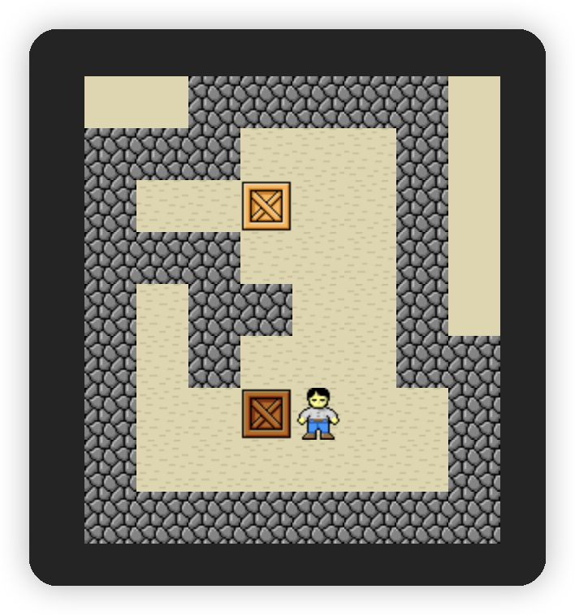

# sokoban-vue3

## [初始化项目](https://github.com/HenryTSZ/sokoban-vue3/tree/68b262e0a4772b868b4f4352bf41939f96a6b7ad)

## [创建地图](https://github.com/HenryTSZ/sokoban-vue3/tree/34ea99dbe041f1789aacd3aac3c7ad1f0b987fbd)

## [重构及单测地图](https://github.com/HenryTSZ/sokoban-vue3/tree/14888773c1b9d4c2c9a1f890cf836229dc0a66f7)

## [添加玩家](https://github.com/HenryTSZ/sokoban-vue3/tree/8b487da65560ececa311a5b7be7c3400e99608cf)

## [玩家移动位置](https://github.com/HenryTSZ/sokoban-vue3/tree/9acd676ee8399f2f41e666363a4ddf273c1930c4)

## [碰撞检测](https://github.com/HenryTSZ/sokoban-vue3/tree/76f2289456bfde01ede6f4b0948f8a3a5f78b5a6)

## [重构玩家数据结构](https://github.com/HenryTSZ/sokoban-vue3/tree/63fb1f9bd9915a4450b0b6c89deee6e11be7dd06)

## [完成玩家移动位置](https://github.com/HenryTSZ/sokoban-vue3/tree/3510c6b4f6509e21b5a36742b1527f74f1be9be9)

## [添加箱子](https://github.com/HenryTSZ/sokoban-vue3/tree/5275e5a04d37221b8e324e74aed5f539735c0f4b)

## [玩家推着箱子移动](https://github.com/HenryTSZ/sokoban-vue3/tree/0d342cc8055e080d1380ca282a8974c3b8157b2a)

## [箱子的碰撞检测](https://github.com/HenryTSZ/sokoban-vue3/tree/647a0520c5c760d5ae97a63292927d7fac684306)

## [完成箱子移动位置](https://github.com/HenryTSZ/sokoban-vue3/tree/d4357f05de68758614ea555ad7a6a496b37c2abd)

## [解决 Map.vue 遗留报错问题](https://github.com/HenryTSZ/sokoban-vue3/tree/4ac226cc42426d69b8b5ded3e3bb38ce9ad9f0aa)

## [重构移动逻辑](https://github.com/HenryTSZ/sokoban-vue3/tree/99b7c77ab47744ee8d1a4d6d5cbc230205fa0804)

## [箱子与箱子的碰撞检测](https://github.com/HenryTSZ/sokoban-vue3/tree/7531444c086a345cce0855ef7956598b19fd8ef7)

## [添加放置点](https://github.com/HenryTSZ/sokoban-vue3/tree/252048acc321dd3c0fadf645ca558d0f612f26d7)

## 箱子与放置点的碰撞检测

具体检测逻辑：当箱子的位置发生改变后，检测箱子的位置，是不是匹配到了放置点，如果匹配上的话，那么就需要改变箱子的状态

继续写测试：

由于我们当时设计的地图不满足现在的需求了，里面没有放置点，所以我们可以先在当前测试中重新创建一个地图，先保证测试通过

然后添加和放置点的碰撞测试

```ts
it('should on target place point when hit target', () => {
  initMap([[1, 2, 2, 3, 1]])
  initKeeper({ x: 1, y: 0 })
  initCargos([{ x: 2, y: 0 }])
  fighting(Direction.Left)
  const cargo = getCargos()[0]
  expect(cargo.onTargetPoint).toBe(true)
})
```

目前的测试是不通过的，我们需要处理 `cargo` 的 `onTargetPoint`

先给 `Cargo` 添加一个 `onTargetPoint` 的属性

```ts
export interface Cargo extends Position {
  onTargetPoint?: boolean
}
```

然后还需要添加一个与放置点的碰撞检测

```ts
export const targetCollision = (position: Position) => {
  return getElementByPosition(position.x, position.y).name === 'Target'
}
```

那我们还需要在 `fighting.ts` 中处理，具体检测逻辑与墙类似

```ts
if (cargo) {
  if (wallCollision(calcPosition(cargo))) {
    return
  }
  if (cargoCollision(calcPosition(cargo))) {
    return
  }
  cargo[directionName] += directionValue

  cargo.onTargetPoint = targetCollision(cargo)
}
```

测试通过了

再去处理页面逻辑

```vue
<template>
  
</template>
```

页面也没有问题了


