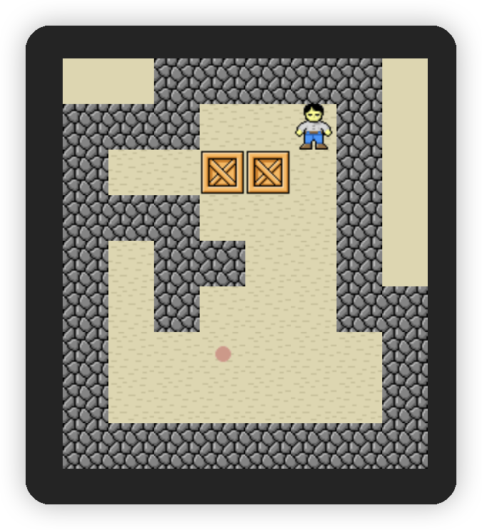

# sokoban-vue3

## [初始化项目](https://github.com/HenryTSZ/sokoban-vue3/tree/68b262e0a4772b868b4f4352bf41939f96a6b7ad)

## [创建地图](https://github.com/HenryTSZ/sokoban-vue3/tree/34ea99dbe041f1789aacd3aac3c7ad1f0b987fbd)

## [重构及单测地图](https://github.com/HenryTSZ/sokoban-vue3/tree/14888773c1b9d4c2c9a1f890cf836229dc0a66f7)

## [添加玩家](https://github.com/HenryTSZ/sokoban-vue3/tree/8b487da65560ececa311a5b7be7c3400e99608cf)

## [玩家移动位置](https://github.com/HenryTSZ/sokoban-vue3/tree/9acd676ee8399f2f41e666363a4ddf273c1930c4)

## [碰撞检测](https://github.com/HenryTSZ/sokoban-vue3/tree/76f2289456bfde01ede6f4b0948f8a3a5f78b5a6)

## [重构玩家数据结构](https://github.com/HenryTSZ/sokoban-vue3/tree/63fb1f9bd9915a4450b0b6c89deee6e11be7dd06)

## [完成玩家移动位置](https://github.com/HenryTSZ/sokoban-vue3/tree/3510c6b4f6509e21b5a36742b1527f74f1be9be9)

## [添加箱子](https://github.com/HenryTSZ/sokoban-vue3/tree/5275e5a04d37221b8e324e74aed5f539735c0f4b)

## [玩家推着箱子移动](https://github.com/HenryTSZ/sokoban-vue3/tree/0d342cc8055e080d1380ca282a8974c3b8157b2a)

## [箱子的碰撞检测](https://github.com/HenryTSZ/sokoban-vue3/tree/647a0520c5c760d5ae97a63292927d7fac684306)

## [完成箱子移动位置](https://github.com/HenryTSZ/sokoban-vue3/tree/d4357f05de68758614ea555ad7a6a496b37c2abd)

## [解决 Map.vue 遗留报错问题](https://github.com/HenryTSZ/sokoban-vue3/tree/4ac226cc42426d69b8b5ded3e3bb38ce9ad9f0aa)

## [重构移动逻辑](https://github.com/HenryTSZ/sokoban-vue3/tree/99b7c77ab47744ee8d1a4d6d5cbc230205fa0804)

## [箱子与箱子的碰撞检测](https://github.com/HenryTSZ/sokoban-vue3/tree/7531444c086a345cce0855ef7956598b19fd8ef7)

## 添加放置点

目前我们的移动逻辑都写完了，但还缺少通关的关键一步：放置点，只有把箱子都推到放置点上，才能通关。

那具体逻辑就是：当箱子的位置发生改变后，检测箱子的位置 是不是匹配到了放置点，如果匹配上的话，那么就需要改变箱子的状态。

我们先将放置点添加到地图上

这里有两种方式：

1. 与 Cargo 类似，不属于地图的一部分，需要执行 `init` 方法
2. 与 Empty 类似，属于地图的一部分，比上面需要处理的逻辑简单一点

我们就采用第二种方式。

目前我们的地图有三种类型：空白/墙/地板，再添加一个类型：放置点。

还是先去写测试，由于我们已经有 `map` 的单测了，只需要在其上添加 `target` 即可

```ts
describe('Map', () => {
  it('should initMap', () => {
    const rowMap = [[0, 1, 2, 3]]
    const map = initMap(rowMap)
    expect(map).toEqual([[new Empty(), new Wall(), new Floor(), new Target()]])
  })
})
```

这里我们缺少 `Target` 类，我们先创建一个

```ts
export class Target {
  public name = 'Target'
}
```

当然测试还是报错的，我们需要去 `initMap` 方法中添加 `target`

```ts
case 3:
  row.push(new Target())
  break
```

这样就可以通过

然后我们去修改页面组件

首先我们先创建 `Target` 组件，与 `Empty` 类似

```vue
<template>
  
</template>

<script setup lang="ts">
import target from '../assets/target.png'
</script>

<style scoped></style>
```

然后在 `Map.vue` 中添加

同时需要修改初始地图数据及 `componentMap`

```ts
<script setup lang="ts">
import Empty from './Empty.vue'
import Wall from './Wall.vue'
import Floor from './Floor.vue'
import Target from './Target.vue'
import { initMap } from '../game/map'
import { type Component } from 'vue'

// 0. 空白
// 1. 墙
// 2. 地板
// 3. 放置点
const rowMap = [
  [0, 0, 1, 1, 1, 1, 1, 0],
  [1, 1, 1, 2, 2, 2, 1, 0],
  [1, 2, 2, 2, 2, 2, 1, 0],
  [1, 1, 1, 2, 2, 2, 1, 0],
  [1, 2, 1, 1, 2, 2, 1, 0],
  [1, 2, 1, 2, 2, 2, 1, 1],
  [1, 2, 2, 3, 2, 2, 2, 1],
  [1, 2, 2, 2, 2, 2, 2, 1],
  [1, 1, 1, 1, 1, 1, 1, 1]
]

const map = initMap(rowMap)

const componentMap: Record<string, Component> = {
  Empty,
  Wall,
  Floor,
  Target
}
</script>
```

这样就可以在地图上显示出来了


