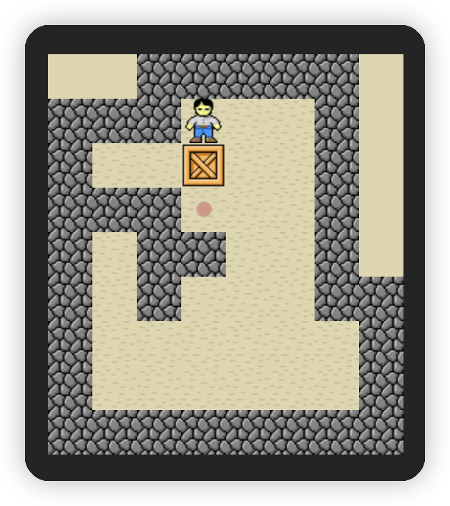
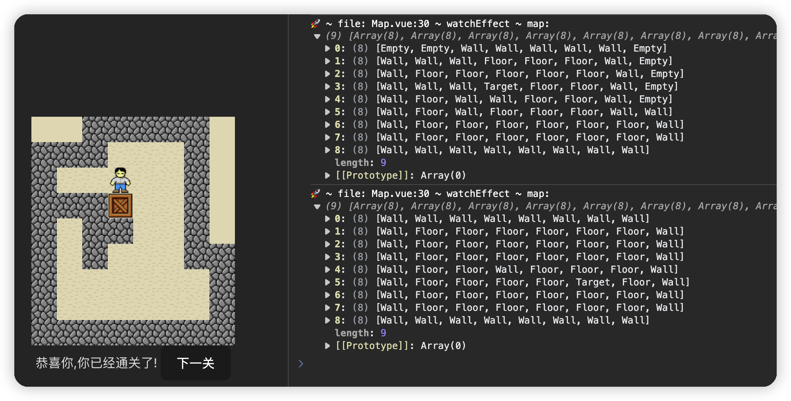
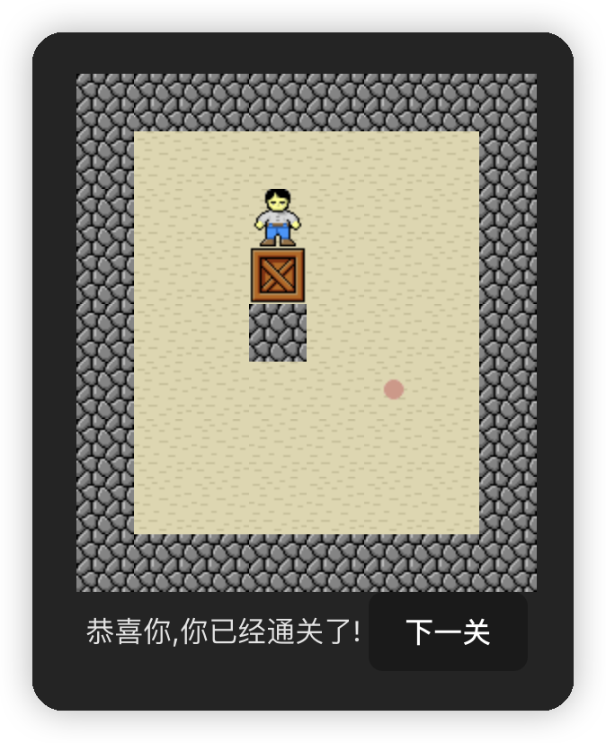
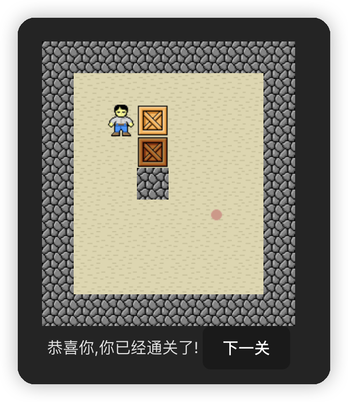
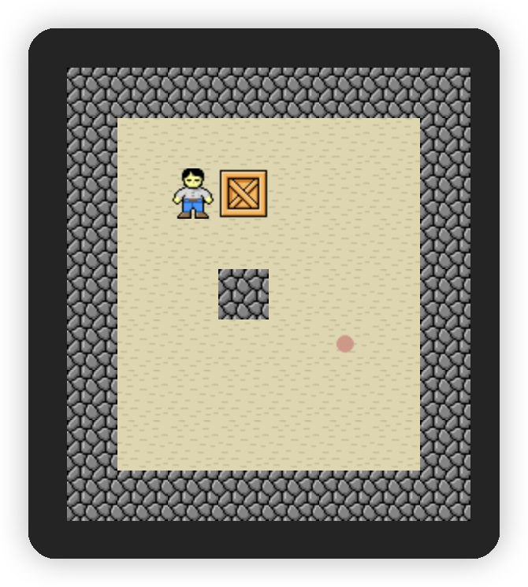

# sokoban-vue3

## [初始化项目](https://github.com/HenryTSZ/sokoban-vue3/tree/68b262e0a4772b868b4f4352bf41939f96a6b7ad)

## [创建地图](https://github.com/HenryTSZ/sokoban-vue3/tree/34ea99dbe041f1789aacd3aac3c7ad1f0b987fbd)

## [重构及单测地图](https://github.com/HenryTSZ/sokoban-vue3/tree/14888773c1b9d4c2c9a1f890cf836229dc0a66f7)

## [添加玩家](https://github.com/HenryTSZ/sokoban-vue3/tree/8b487da65560ececa311a5b7be7c3400e99608cf)

## [玩家移动位置](https://github.com/HenryTSZ/sokoban-vue3/tree/9acd676ee8399f2f41e666363a4ddf273c1930c4)

## [碰撞检测](https://github.com/HenryTSZ/sokoban-vue3/tree/76f2289456bfde01ede6f4b0948f8a3a5f78b5a6)

## [重构玩家数据结构](https://github.com/HenryTSZ/sokoban-vue3/tree/63fb1f9bd9915a4450b0b6c89deee6e11be7dd06)

## [完成玩家移动位置](https://github.com/HenryTSZ/sokoban-vue3/tree/3510c6b4f6509e21b5a36742b1527f74f1be9be9)

## [添加箱子](https://github.com/HenryTSZ/sokoban-vue3/tree/5275e5a04d37221b8e324e74aed5f539735c0f4b)

## [玩家推着箱子移动](https://github.com/HenryTSZ/sokoban-vue3/tree/0d342cc8055e080d1380ca282a8974c3b8157b2a)

## [箱子的碰撞检测](https://github.com/HenryTSZ/sokoban-vue3/tree/647a0520c5c760d5ae97a63292927d7fac684306)

## [完成箱子移动位置](https://github.com/HenryTSZ/sokoban-vue3/tree/d4357f05de68758614ea555ad7a6a496b37c2abd)

## [解决 Map.vue 遗留报错问题](https://github.com/HenryTSZ/sokoban-vue3/tree/4ac226cc42426d69b8b5ded3e3bb38ce9ad9f0aa)

## [重构移动逻辑](https://github.com/HenryTSZ/sokoban-vue3/tree/99b7c77ab47744ee8d1a4d6d5cbc230205fa0804)

## [箱子与箱子的碰撞检测](https://github.com/HenryTSZ/sokoban-vue3/tree/7531444c086a345cce0855ef7956598b19fd8ef7)

## [添加放置点](https://github.com/HenryTSZ/sokoban-vue3/tree/252048acc321dd3c0fadf645ca558d0f612f26d7)

## [箱子与放置点的碰撞检测](https://github.com/HenryTSZ/sokoban-vue3/tree/70da190fc5ef796eab8ed2b2f9c103f1c7e321f5)

## [检测游戏是否胜利](https://github.com/HenryTSZ/sokoban-vue3/tree/c99ae23cefbc9ebf360e413b09fb4741f368e2cf)

## 进入下一关

游戏胜利以后要怎么办呢？应该是进入下一关

在此之前，我们还需要处理几件事：

1. 重置所有数据
2. 获取到下一关数据并初始化
3. 跳转到下一关

这里的关卡数据就包括 地图数据/箱子数据/玩家数据

由于现在这些数据都在各自组件中, 所以我们需要把它们抽离出来，我们需要先创建一个所有关卡的数据

### 创建关卡数据

在 `src/game/gameData.ts` 中创建关卡数据，第一关的数据就使用我们之前创建的，为了能快速通关，我们就设置一个放置点吧，第二关我们就先改变一下地图数据，别的先不动，能渲染就可以

具体的代码见 `src/game/gameData.ts`

如何拿到关卡数据呢？

可以通过 `gameDatas[getGame().level]` 拿到对应关卡的数据, 然后初始化地图等数据

### 初始化地图等数据

```ts
const map = initMap(gameDatas[getGame().level].map)
```

由于我们初始化的 `level` 是 1，所以这里的数据应该是第二关的数据，而我们需要的是第一关的数据，所以初始化还是改成 0 吧，方便取值

```ts
const game = reactive({
  isWin: false,
  level: 0
})
```

数据拿到了，页面也能正常渲染了

同理将玩家和箱子数据初始化

```ts
const keeper: Keeper = reactive(gameDatas[getGame().level].keeper)

const cargos: Cargo[] = reactive(gameDatas[getGame().level].cargos)
```

页面显示没问题，功能也正常



### 进入下一关逻辑

目前我们通关以后，只是显示了文字提示，应该再加一个按钮，进入下一关

```vue
<div v-if="game.isWin">
  恭喜你,你已经通关了!
  <button @click="handleNextLevel">下一关</button>
</div>

const handleNextLevel = () => { game.level++ }
```

页面显示没问题，但点击后却没改变

这是肯定的啊，我们的 `initMap` 等函数只执行了一遍，`level` 改变后并没有再执行

所以我们需要监听 `getGame().level` 的变化，当变化的时候执行 `initMap` 等函数

```ts
let map: Element[][]

watchEffect(() => {
  map = initMap(gameDatas[getGame().level].map)
  console.log('🚀 ~ file: Map.vue:30 ~ watchEffect ~ map:', map)
})
```

但点击后仍然没有改变

通过打印输出可知数据已经变化了：



那这又是响应式的问题了，需要使用 `reactive` 进行包装

```ts
let map: Element[][] = reactive([])

watchEffect(() => {
  initMap(gameDatas[getGame().level].map).forEach((row, index) => {
    map[index] = row
  })
  console.log('🚀 ~ file: Map.vue:30 ~ watchEffect ~ map:', map)
})
```

这样点击下一关后地图就变化了



那我们再处理一下玩家和箱子的数据

```ts
let keeper: Keeper = reactive({} as Keeper)
let positionStyle: ComputedRef<string>

watchEffect(() => {
  const keeperData = gameDatas[getGame().level].keeper
  keeper.x = keeperData.x
  keeper.y = keeperData.y
  initKeeper(keeper)

  positionStyle = usePosition(keeper)
})
```

```ts
let cargos: Cargo[] = reactive([])
let positionStyles: ComputedRef<string>[]

watchEffect(() => {
  gameDatas[getGame().level].cargos.forEach(cargo => {
    cargos.push(cargo)
  })
  initCargos(cargos)

  positionStyles = cargos.map(cargo => usePosition(cargo))
})
```

现在进入下一关所有数据都变了，但箱子由于我们没有清除上一关的数据，所以还是会显示上一关的箱子，而且通关状态也没有改变



所以在 `push` 前需要清空数组，`map` 由于我们直接修改的 `index`，所以可以正常显示，不过也还是清除一下吧，万一两关地图大小不一致，就有问题了

清除就使用 `map.length = 0` 和 `cargos.length = 0` 就可以了

通关状态也重置一下

```ts
const handleNextLevel = () => {
  game.level++
  game.isWin = false
}
```

这样就没有问题了


