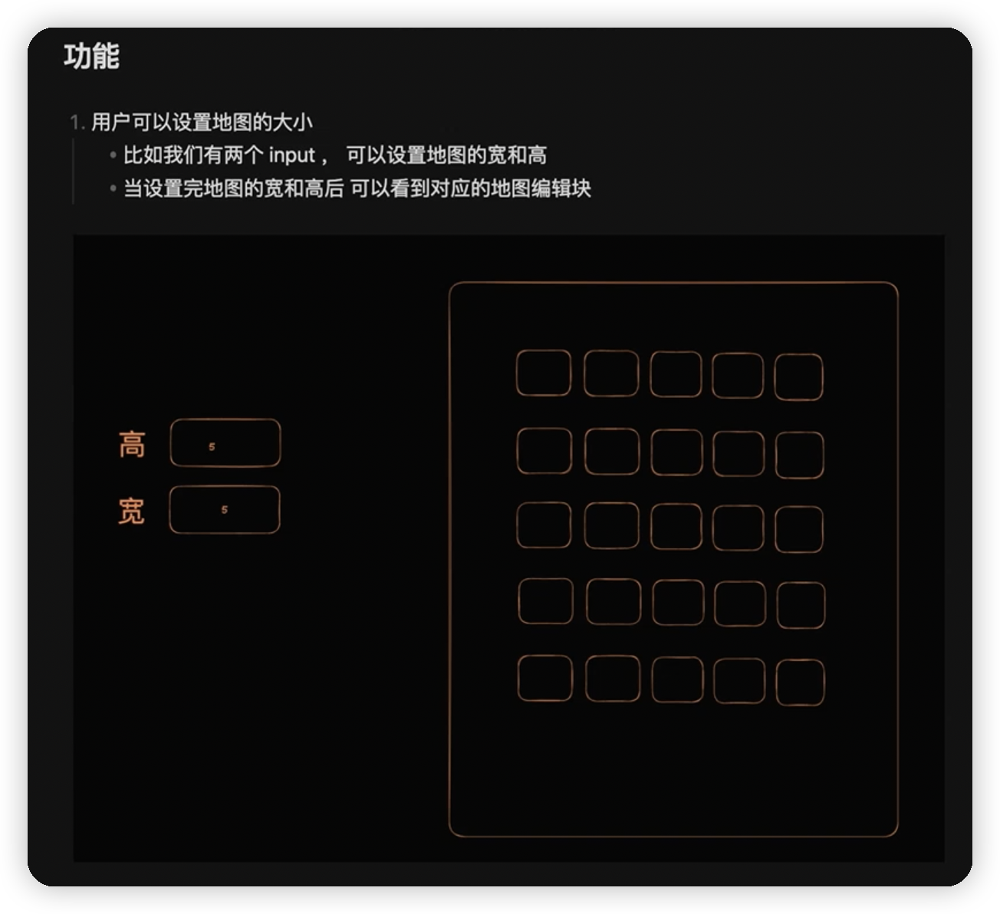
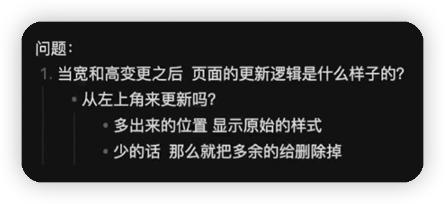
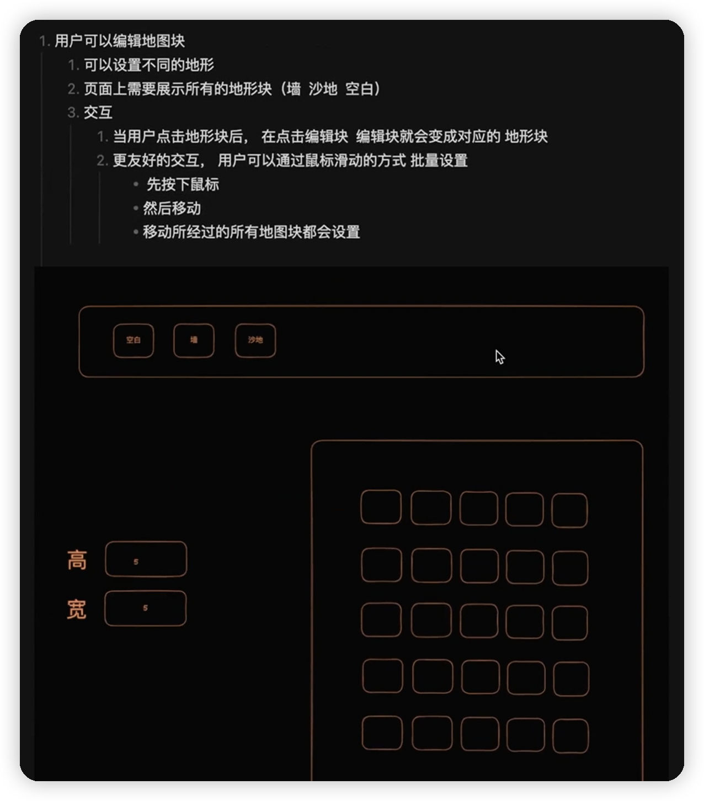
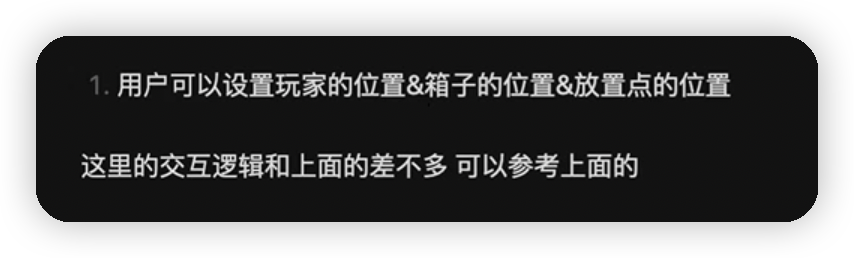
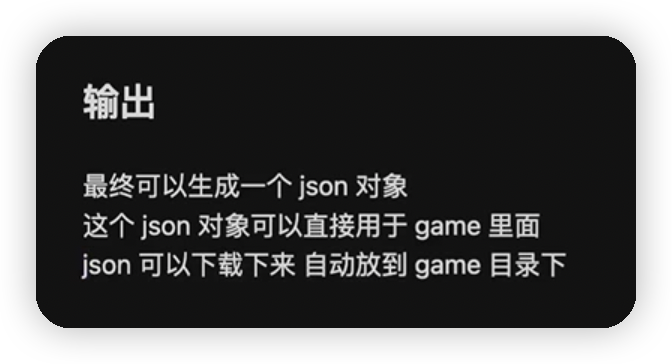

# sokoban-vue3

## [初始化项目](https://github.com/HenryTSZ/sokoban-vue3/tree/68b262e0a4772b868b4f4352bf41939f96a6b7ad)

## [创建地图](https://github.com/HenryTSZ/sokoban-vue3/tree/34ea99dbe041f1789aacd3aac3c7ad1f0b987fbd)

## [重构及单测地图](https://github.com/HenryTSZ/sokoban-vue3/tree/14888773c1b9d4c2c9a1f890cf836229dc0a66f7)

## [添加玩家](https://github.com/HenryTSZ/sokoban-vue3/tree/8b487da65560ececa311a5b7be7c3400e99608cf)

## [玩家移动位置](https://github.com/HenryTSZ/sokoban-vue3/tree/9acd676ee8399f2f41e666363a4ddf273c1930c4)

## [碰撞检测](https://github.com/HenryTSZ/sokoban-vue3/tree/76f2289456bfde01ede6f4b0948f8a3a5f78b5a6)

## [重构玩家数据结构](https://github.com/HenryTSZ/sokoban-vue3/tree/63fb1f9bd9915a4450b0b6c89deee6e11be7dd06)

## [完成玩家移动位置](https://github.com/HenryTSZ/sokoban-vue3/tree/3510c6b4f6509e21b5a36742b1527f74f1be9be9)

## [添加箱子](https://github.com/HenryTSZ/sokoban-vue3/tree/5275e5a04d37221b8e324e74aed5f539735c0f4b)

## [玩家推着箱子移动](https://github.com/HenryTSZ/sokoban-vue3/tree/0d342cc8055e080d1380ca282a8974c3b8157b2a)

## [箱子的碰撞检测](https://github.com/HenryTSZ/sokoban-vue3/tree/647a0520c5c760d5ae97a63292927d7fac684306)

## [完成箱子移动位置](https://github.com/HenryTSZ/sokoban-vue3/tree/d4357f05de68758614ea555ad7a6a496b37c2abd)

## [解决 Map.vue 遗留报错问题](https://github.com/HenryTSZ/sokoban-vue3/tree/4ac226cc42426d69b8b5ded3e3bb38ce9ad9f0aa)

## [重构移动逻辑](https://github.com/HenryTSZ/sokoban-vue3/tree/99b7c77ab47744ee8d1a4d6d5cbc230205fa0804)

## [箱子与箱子的碰撞检测](https://github.com/HenryTSZ/sokoban-vue3/tree/7531444c086a345cce0855ef7956598b19fd8ef7)

## [添加放置点](https://github.com/HenryTSZ/sokoban-vue3/tree/252048acc321dd3c0fadf645ca558d0f612f26d7)

## [箱子与放置点的碰撞检测](https://github.com/HenryTSZ/sokoban-vue3/tree/70da190fc5ef796eab8ed2b2f9c103f1c7e321f5)

## [检测游戏是否胜利](https://github.com/HenryTSZ/sokoban-vue3/tree/c99ae23cefbc9ebf360e413b09fb4741f368e2cf)

## [进入下一关](https://github.com/HenryTSZ/sokoban-vue3/tree/07c7d67d567e639c7ce7471e20274de27e894482)

## [重构所有数据处理](https://github.com/HenryTSZ/sokoban-vue3/tree/eb75dd380425938a859f182a79145e979e958412)

## [解决 Cargo 报错](https://github.com/HenryTSZ/sokoban-vue3/tree/f811eb965bc6fe8852eebaf3d96440362f9e914f)

## [统一导出口](https://github.com/HenryTSZ/sokoban-vue3/tree/ee72436e762bf2c41f1f5a36d54561d2d5fdc453)

## [重构命名](https://github.com/HenryTSZ/sokoban-vue3/tree/b8af3b48618eb628e27f3ed4bcc534217920af83)

## 地图编辑器

目的是让游戏变的更完整一些

然后地图编辑器的实现也和传统的前端逻辑比较符合

