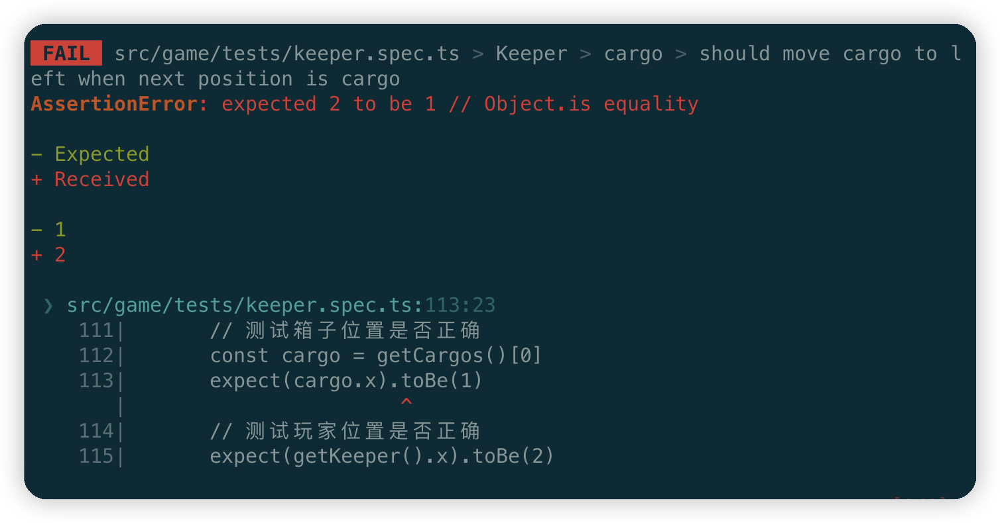

# sokoban-vue3

## [初始化项目](https://github.com/HenryTSZ/sokoban-vue3/tree/68b262e0a4772b868b4f4352bf41939f96a6b7ad)

## [创建地图](https://github.com/HenryTSZ/sokoban-vue3/tree/34ea99dbe041f1789aacd3aac3c7ad1f0b987fbd)

## [重构及单测地图](https://github.com/HenryTSZ/sokoban-vue3/tree/14888773c1b9d4c2c9a1f890cf836229dc0a66f7)

## [添加玩家](https://github.com/HenryTSZ/sokoban-vue3/tree/8b487da65560ececa311a5b7be7c3400e99608cf)

## [玩家移动位置](https://github.com/HenryTSZ/sokoban-vue3/tree/9acd676ee8399f2f41e666363a4ddf273c1930c4)

## [碰撞检测](https://github.com/HenryTSZ/sokoban-vue3/tree/76f2289456bfde01ede6f4b0948f8a3a5f78b5a6)

## [重构玩家数据结构](https://github.com/HenryTSZ/sokoban-vue3/tree/63fb1f9bd9915a4450b0b6c89deee6e11be7dd06)

## [完成玩家移动位置](https://github.com/HenryTSZ/sokoban-vue3/tree/3510c6b4f6509e21b5a36742b1527f74f1be9be9)

## [添加箱子](https://github.com/HenryTSZ/sokoban-vue3/tree/5275e5a04d37221b8e324e74aed5f539735c0f4b)

## 玩家推着箱子移动

当玩家移动时，需要查找所有的箱子，如果玩家的下一个位置是箱子，就将该箱子和玩家一起向玩家移动的方向移动(暂时不考虑墙)

我们先写单测

### 整理以前的单测

目前我们把 `keeper` 的移动和与墙的碰撞检测的单测都写好了，我们把这些单测合并在一起

```ts
describe('Keeper', () => {
  describe('move and wall collision', () => {
    beforeEach(() => {
      // 初始化地图
      initMap([
        [1, 1, 1, 1],
        [1, 2, 2, 1],
        [1, 2, 2, 1],
        [1, 1, 1, 1]
      ])
    })

    describe('move left', () => {
      it('should move to left when next is not wall', () => {
        // 初始化玩家位置
        initKeeper({ x: 2, y: 1 })
        // 向左移动
        moveLeft()
        // 测试玩家位置是否正确
        expect(getKeeper().x).toBe(1)
      })
      it('should not move to left when next is wall', () => {
        // 初始化玩家位置
        initKeeper({ x: 1, y: 1 })
        // 向左移动
        moveLeft()
        // 测试玩家位置是否正确
        expect(getKeeper().x).toBe(1)
      })
    })

    describe('move right', () => {
      it('should move to right when next is not wall', () => {
        // 初始化玩家位置
        initKeeper({ x: 1, y: 1 })
        // 向右移动
        moveRight()
        // 测试玩家位置是否正确
        expect(getKeeper().x).toBe(2)
      })
      it('should not move to right when next is wall', () => {
        // 初始化玩家位置
        initKeeper({ x: 2, y: 1 })
        // 向右移动
        moveRight()
        // 测试玩家位置是否正确
        expect(getKeeper().x).toBe(2)
      })
    })

    describe('move up', () => {
      it('should move up when next is not wall', () => {
        // 初始化玩家位置
        initKeeper({ x: 1, y: 2 })
        // 向上移动
        moveUp()
        // 测试玩家位置是否正确
        expect(getKeeper().y).toBe(1)
      })
      it('should not move up when next is wall', () => {
        // 初始化玩家位置
        initKeeper({ x: 1, y: 1 })
        // 向上移动
        moveUp()
        // 测试玩家位置是否正确
        expect(getKeeper().y).toBe(1)
      })
    })

    describe('move down', () => {
      it('should move down when next is not wall', () => {
        // 初始化玩家位置
        initKeeper({ x: 1, y: 1 })
        // 向下移动
        moveDown()
        // 测试玩家位置是否正确
        expect(getKeeper().y).toBe(2)
      })
      it('should not move down when next is wall', () => {
        // 初始化玩家位置
        initKeeper({ x: 1, y: 2 })
        // 向下移动
        moveDown()
        // 测试玩家位置是否正确
        expect(getKeeper().y).toBe(2)
      })
    })
  })
})
```

### TDD 方式写箱子的单测

然后去写箱子的单测

```ts
describe('cargo', () => {
  beforeEach(() => {
    initMap([
      [1, 1, 1, 1, 1],
      [1, 2, 2, 2, 1],
      [1, 2, 2, 2, 1],
      [1, 1, 1, 1, 1]
    ])
  })
  it('should move cargo to left when next position is cargo', () => {
    // 初始化玩家
    initKeeper({ x: 3, y: 1 })
    // 初始化箱子
    initCargos([{ x: 2, y: 1 }])
    // 向左移动
    moveLeft()
    // 测试箱子位置是否正确
    const cargo = getCargos()[0]
    expect(cargo.x).toBe(1)
    // 测试玩家位置是否正确
    expect(getKeeper().x).toBe(2)
  })
})
```

当然现在测试是不通过的



那我们去实现一下

### 实现箱子的移动

箱子移动是由玩家移动触发的，所以我们应该在 `keeper.ts` 中实现

按照惯例，还是先看向左移动的方法

```ts
export const moveLeft = () => {
  if (wallCollisionLeft(_keeper)) {
    return
  }
  // 1. 需要获取到 next left position 上的 cargo
  const cargo = getCargos().find(cargo => cargo.x === _keeper.x - 1 && cargo.y === _keeper.y)
  // 2. 改变这个 cargo 的位置
  if (cargo) {
    cargo.x--
  }
  _keeper.x--
}
```

测试通过

再去页面看看，玩家可以推着箱子移动了


### 重构箱子移动逻辑

获取箱子的逻辑目前是在 `keeper.ts` 中实现的，但其实应该在 `cargo.ts` 中实现

所以我们可以暴露一个 `getCargoByPosition` 的函数

```ts
export const getCargoByPosition = (position: Position): Cargo | undefined => {
  return _cargos.find(cargo => cargo.x === position.x && cargo.y === position.y)
}
```

然后在 `keeper.ts` 中替换一下

```ts
// 1. 需要获取到 next left position 上的 cargo
const cargo = getCargoByPosition({ x: _keeper.x - 1, y: _keeper.y })
```

基于小步走的原则，查看测试是没问题的

这样就体现出测试的好处了，修改一点点就能知道有没有问题，否则只能去页面点点才能知道有没有问题

另一个重构地方就是 `{ x: _keeper.x - 1, y: _keeper.y }` 在 `moveLeft` 中，出现了两次，我们可以把它合并到一起

```ts
export const moveLeft = () => {
  const position = { x: _keeper.x - 1, y: _keeper.y }
  if (wallCollisionLeft(position)) {
    return
  }
  // 1. 需要获取到 next left position 上的 cargo
  const cargo = getCargoByPosition(position)
  // 2. 改变这个 cargo 的位置
  if (cargo) {
    cargo.x--
  }
  _keeper.x--
}
```

发现测试报错了

由于我们是小步走开发，这种情况我们先不去找哪里错了，直接撤销修改，直到测试通过

然后我们不去修改 `wallCollisionLeft` 的参数，而是给它加一个参数：`position`

```ts
const position = { x: _keeper.x - 1, y: _keeper.y }
if (wallCollisionLeft(_keeper, position)) {
  return
}
```

进到 `wallCollisionLeft` 里面，发现这里的 `x` 也减 `1` 了，而我们其实已经处理过了，所以这里就不需要再处理了

```ts
export const wallCollisionLeft = (position: Position) => {
  return getElementByPosition(position.x, position.y).name === 'Wall'
}
```

然后使用我们新加的参数替换旧参数就可以了

测试通过了
